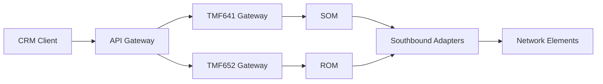
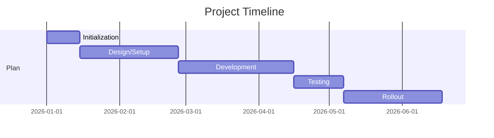

# Pre-Sales PDF To Project Markdown

Use this skill when the user wants structured project documentation generated from PDFs stored in the pre-sales opportunity folder.

## Folder Rules

- Source PDFs must be read from `pre-sales-oppertunity/`.
- If `pre-sales-oppertunity/` does not exist, check `pre-sales-oopertunity/`.
- If both folders exist, prefer `pre-sales-oppertunity/`.

## Output Rules

- Create one Markdown file per input PDF.
- Place output in `docs/oppertunity/`.
- Name output as `<Opportunity-Name>.md` (CamelCase or dash-separated, based on PDF content).
- Extract opportunity/project name from the PDF title or first section.
- Keep content project-specific and remove generic filler.

## Required Sections In Markdown

Use these sections in this order:

1. `# Project Overview`
2. `## Client Context`
3. `## Business Goals`
4. `## Scope and Requirements`
5. `## Proposed Solution`
6. `## Deliverables`
7. `## Timeline and Milestones`
8. `## Risks and Assumptions`
9. `## Open Questions`
10. `## Next Steps`

## Diagram Rendering Rules

- Use Mermaid fenced blocks so diagrams render in MkDocs:
   - Start block with ` ```mermaid ` and close with ` ``` `
- Add at least these diagrams in each opportunity output file:
   - Solution architecture flowchart under `## Proposed Solution`
   - Delivery timeline diagram under `## Timeline and Milestones`
- Keep node labels short and business-readable.
- Ensure all diagram facts are traceable to the source PDF.

## Implementation Steps

1. **Locate the PDF in pre-sales-oppertunity folder**
   ```bash
   ls pre-sales-oppertunity/
   ```

2. **Extract text from the PDF**
   ```bash
   pdftotext "pre-sales-oppertunity/<filename>.pdf" -
   ```

3. **Extract opportunity name** from the PDF title, first section, or document header

4. **Map PDF content to Markdown sections:**
   - Overview/Description → `# Project Overview`
   - Client info → `## Client Context`
   - Goals/Business case → `## Business Goals`
   - Scope/Requirements → `## Scope and Requirements`
   - Architecture/Approach → `## Proposed Solution`
   - Deliverables/Work packages → `## Deliverables`
   - Timeline/Milestones → `## Timeline and Milestones`
   - Risks/Assumptions/Exclusions → `## Risks and Assumptions`
   - Missing/unclear items → `## Open Questions`
   - Action items/Recommendations → `## Next Steps`

5. **Create the Markdown file** in `docs/oppertunity/<Opportunity-Name>.md` with all 10 required sections populated

6. **Add Mermaid diagrams** in the relevant sections:
   - Architecture flow in `## Proposed Solution`
   - Timeline view in `## Timeline and Milestones`

7. **Validate content:**
   - No hallucinated facts
   - Each section contains meaningful content or TBD notes
   - Metrics/numbers extracted verbatim from PDF
   - Tables and structured data formatted for readability
   - Mermaid blocks render correctly in MkDocs

## Example Command Flow

```bash
# Find PDFs in pre-sales folder
ls pre-sales-oppertunity/*.pdf

# Extract text from specific PDF
pdftotext "pre-sales-oppertunity/OwnCore Provisioning ROM v01.pdf" -

# Output structure created in docs/oppertunity/
docs/oppertunity/OwnCore-Provisioning-ROM.md
```

## Output File Structure

Each output `.md` file should follow this structure:

```markdown
# Project Overview
[Client name, opportunity description, strategic positioning]

## Client Context
[Client details, deployment model, volumetrics]

## Business Goals
[Strategic objectives, success criteria, performance targets]

## Scope and Requirements
[Services, use cases, technical requirements, API specs]

## Proposed Solution
[Architecture, products, key components, integration approach]



## Deliverables
[Work packages, environment setup, testing, support phases]

## Timeline and Milestones
[Duration, key milestones with dates, Gantt details if available]



## Risks and Assumptions
[Key assumptions, exclusions, constraints, dependencies]

## Open Questions
[Items requiring stakeholder clarification or follow-up]

## Next Steps
[Action items, readiness checklist, recommended next phases]
```

## Quality Rules

- Do not invent facts that are not present in the PDF.
- If data is missing, add a short note in `## Open Questions`.
- Keep language concise and delivery-focused.
- Ensure each section has content; use `TBD` only when unavoidable.
