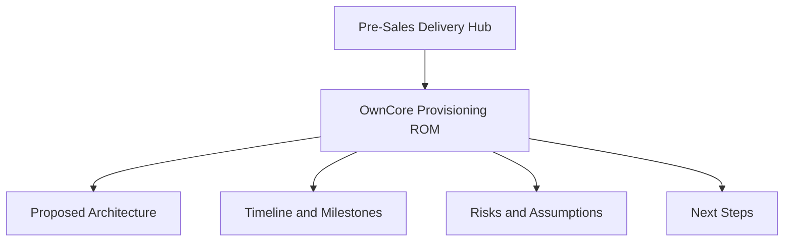

# Orchestration Pre-Sales Delivery Hub

This hub provides a structured view of pre-sales opportunities, solution scope, delivery planning, and next-step actions.

## Opportunity Overview

Current documented opportunities:

- [OwnCore Provisioning ROM](oppertunity/OwnCore-Provisioning-ROM.md)

## Opportunity Map

## Navigation

- Start with [OwnCore Provisioning ROM](oppertunity/OwnCore-Provisioning-ROM.md) for end-to-end opportunity details.
- Use the sections in each opportunity page to review business goals, technical scope, and execution readiness.
